<!DOCTYPE html>
<html lang="zh-Hant">  
<head>
    <meta charset="UTF-8">     
    <meta name="viewport" content="width=device-width, initial-scale=1.0">
    <title> 遙咖啡 | Haruka Coffee </title>
    
</head>
<body>

    

        
        <a href="https://www.instagram.com/harukacoffee_tw?igsh=M2JkZzE3NWx5ZGZ3" class="coffeetopic-link">遙咖啡 Instagram 🔗  </a>
        <a href="https://maps.app.goo.gl/nw6W7ypGhVcsqGdH9" class="coffeetopic-link">地址：433臺中市沙鹿區晉武路35巷30號  </a>
        營業時間（一般來說）：12:00~18:00 
        <a href="tel:+88604 2632 3630" class="coffeetopic-link">電話：04 2632 3630</a>

    <h1> 店家特色</h1>
    <ol type="1">
        <h3>
        <li>室內有許多書可以供顧客閱覽</li>
        <li>有集點卡制度可以兌換小物品</li>
        <li>傍晚向外看就是黃昏美景</li>
        </h3>
    </ol>
    
    <h1>注意事項</h1>
    <ul type="disc">
        <h3>
        <li>低消一杯飲品</li>
        <li>別跟我搶吃的</li>
        </h3>
    </ul>

    <h1>室內環境</h1>
    

            

                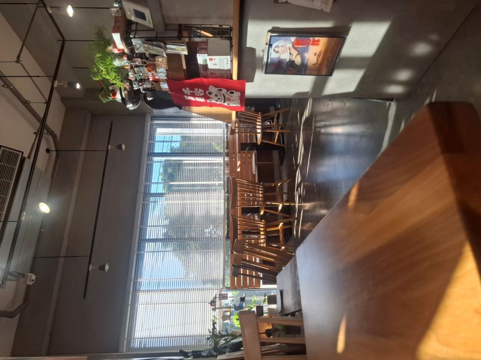
                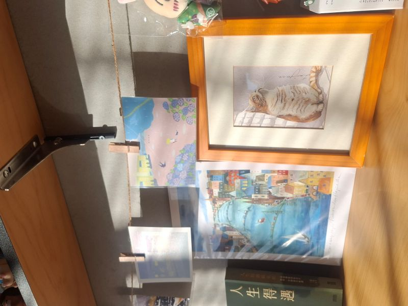  
            

        

            <h3>身為京都和畫畫愛好者的老闆，室內充滿日式及美術氣息，並且擺放許多書籍可供客人借閱。舒適的光線在午後從簾縫流出，伴著80、90年代的西洋歌曲，讓客人下午可以在這幽靜的環境小憩。位置鄰近公園，也適合遛小孩的父母前往。 </h3>
        

            

    <h1>招牌餐點與飲品 </h1>
    

        
        

            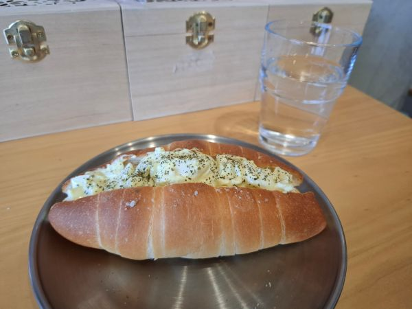
            

                <h2>閃電戰（鹽奶油捲＋蛋沙拉）</h2>
                價格：NT$ 80
                
潛艇般的外型及好吃到讓人以閃電般的速度解決，令兩個抽象人類以閃電戰為此命名。

            

        

        

            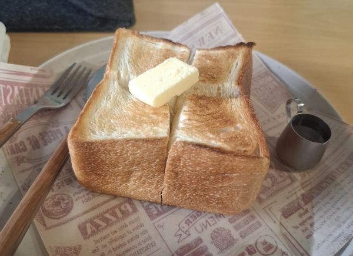
            

                <h2>厚切吐司</h2>
                價格：NT$ 80
                
酥脆的外表加上富有口感的麵包體，淋上蜂蜜和奶油後簡直是人間美味，此物只應天上有！

            

        

        

            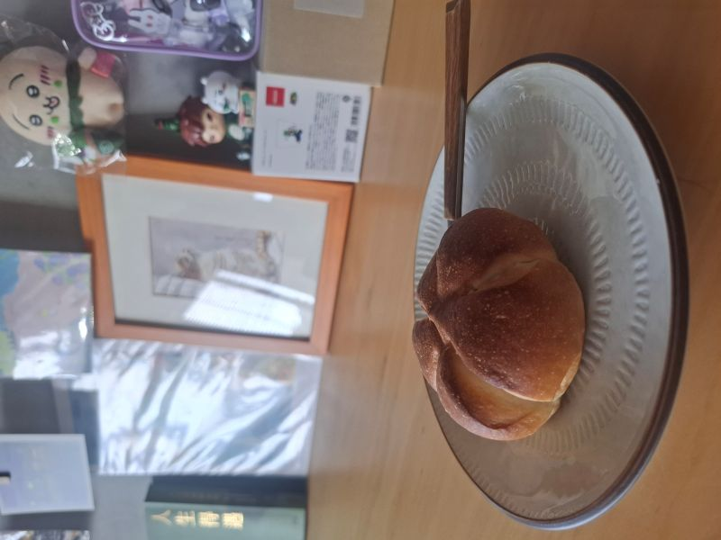
            

                <h2>手作核桃奶酪</h2>
                價格：NT$ 60
                
清爽的奶酪與香脆的核桃簡直是彼此的最佳舞伴，每一口濃郁的奶香與堅果相互呼應，幸福感爆棚。

            

        

        
        

            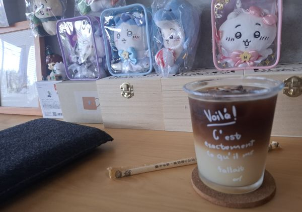
            

                <h2>青森蘋果咖</h2>
                價格：NT$ 150
                
當咖啡的醇厚遇上蘋果汁的清甜，碰撞出驚喜的火花。口感層次豐富，適合喜歡嘗試新鮮風味及偏好清爽的客人。

            

        

        
        

            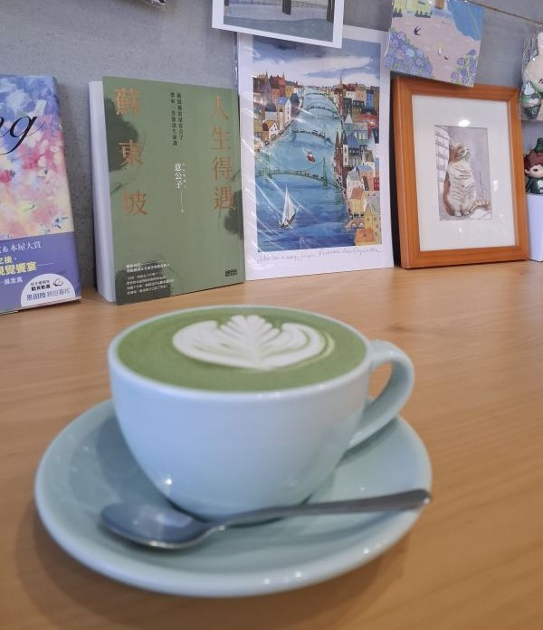
            

                <h2>日本京都抹茶拿鐵</h2>
                價格：NT$ 200~280
                
嚴選抹茶不具粉感，入口順滑香醇，茶香餘韻充斥縈繞在口腔，為您獻上最精采的口腔盛宴。

            

        

        
        

            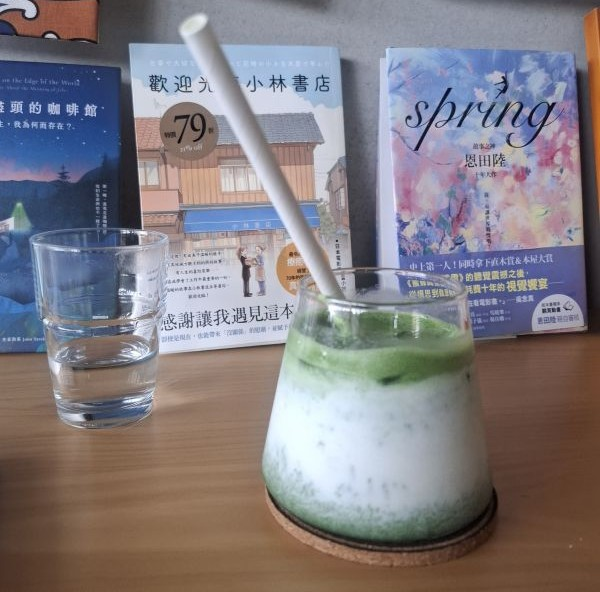
            

                <h2>日本京都抹茶拿鐵（冰）</h2>
                價格：NT$ 200~280
                
在炎熱的午後，抹茶控的最佳首選。細膩的抹茶泡沫與冰塊交融，即使是冰抹茶也不失美味標準。

            

        

        

            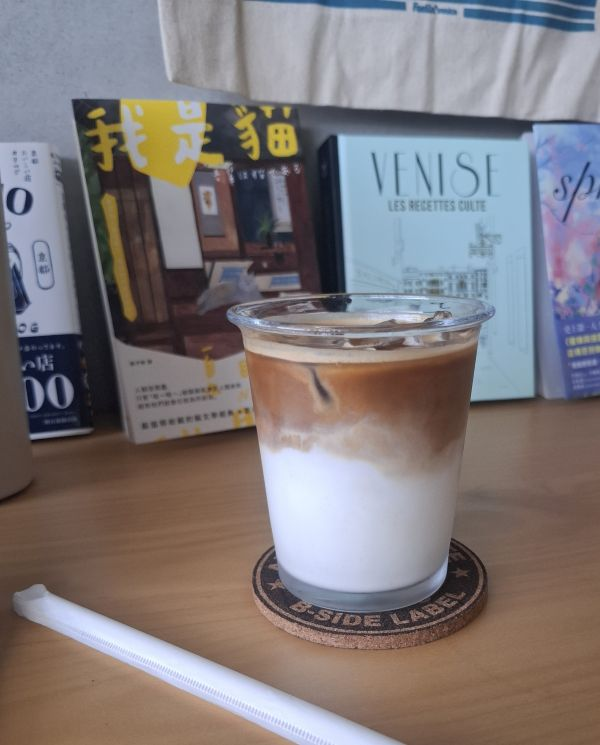
            

                <h2>咖啡拿鐵（冰）</h2>
                價格：NT$ 130
                
使用老闆精選的咖啡豆慢速萃取，口感香醇濃郁，可以自己挑選豆子，組合出自己喜好的口味。

            

        

        
        

            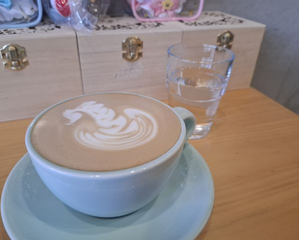
            

                <h2>咖啡拿鐵</h2>
                價格：NT$ 130
                
一杯手沖的熱拿鐵，溫暖您的手心與心靈。濃郁的咖啡香氣與奶香組合，讓客人可在書海中找到一片寧靜之地。

            

        

    

    <h1 style="margin-top: 60px;">黃昏美景</h1>
        

            

                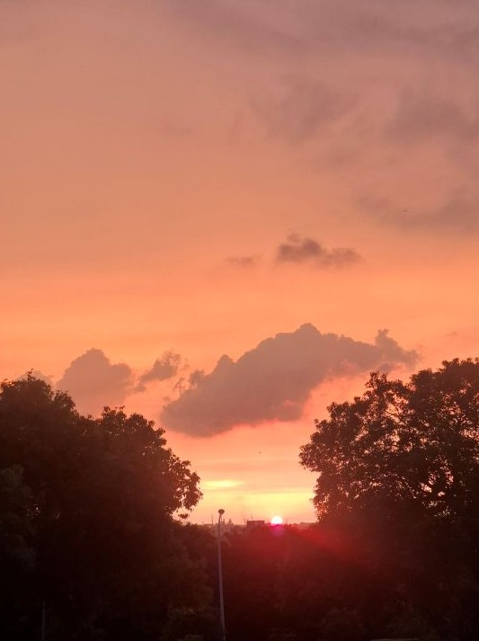
                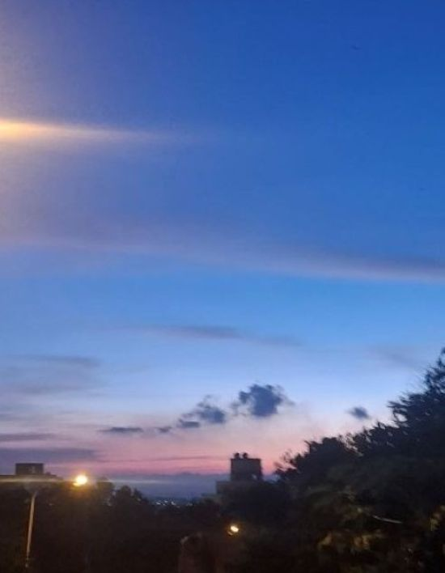
            

            

            <h3>營業結束時分逼近，可從店內透過窗外欣賞上帝的作品，不同季節在畫布上有不同風格的作品讓人欣賞，為每次旅程劃下完美句點。</h3>
            

</body>

</html>
